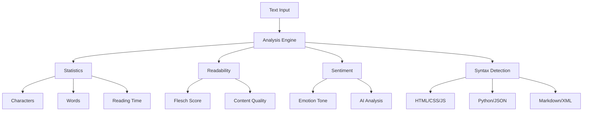
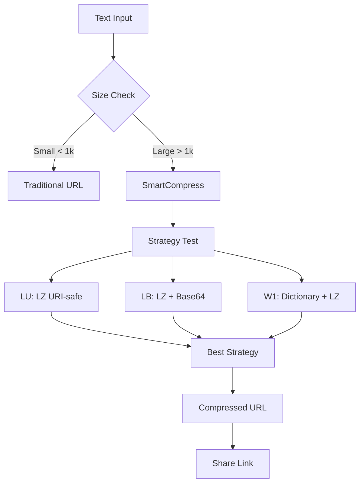
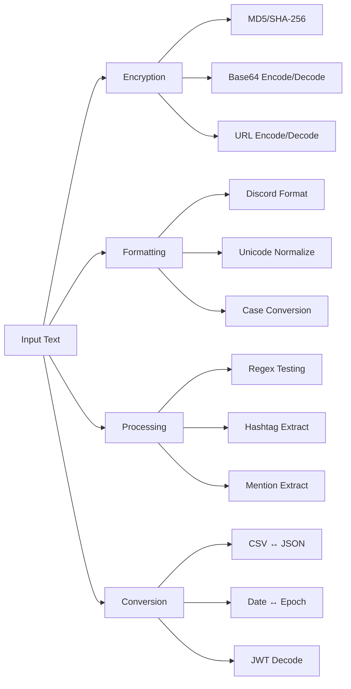
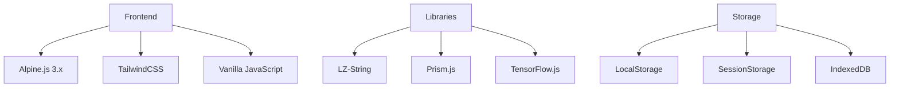

<div align="center">


# Hexa ✨
### *The Ultimate Modern Text Editor*

[](https://fl2on.github.io/Hexa)
[](https://github.com/fl2on/Hexa)
[](https://tailwindcss.com/)
[](https://alpinejs.dev/)

**A powerful, responsive text editor built with cutting-edge web technologies. Experience seamless writing with advanced features, smart compression, AI integration, and comprehensive developer tools.**

---

</div>

## 🎯 Core Features

### ✍️ Advanced Text Editor
- **🌙 Smart Theme System**: Instant dark/light mode switching with zero flicker
- **🎯 Focus Mode**: Distraction-free writing environment
- **📏 Enhanced Line Numbers**: Visual reference with syntax highlighting
- **🖱️ Drag & Drop**: Multi-format file support up to 10MB
- **📱 Mobile-First Design**: Fully responsive across all devices
- **⚡ Performance Optimized**: Handles 100k+ characters smoothly

### 📊 Intelligent Text Analysis



- **📈 Real-time Statistics**: Characters, words, lines, sentences, paragraphs
- **⏱️ Reading Time**: Accurate estimation based on 200 WPM
- **📖 Readability Score**: Flesch Reading Ease analysis
- **🔍 Syntax Detection**: Support for 8+ programming languages
- **📝 Word Frequency Analysis**: Most common words extraction
- **😊 Sentiment Analysis**: Emotional tone detection with AI

### 🛠️ Powerful Text Tools

| Feature | Description | Hotkey |
|---------|-------------|--------|
| **🔤 Text Formatting** | UPPERCASE, lowercase, Title Case, Sentence case | - |
| **🧹 Smart Cleaning** | Remove extra spaces, normalize line breaks | - |
| **🔍 Find & Replace** | Advanced search with regex support | - |
| **↶ Undo/Redo** | 50-state history tracking | `Ctrl+Z`/`Ctrl+Y` |
| **🎨 Autocomplete** | Context-aware code suggestions | - |
| **📋 Smart Select** | Word/line/paragraph selection | - |

### ⏰ Writing Session Tracking
- **⏱️ Active Timer**: Tracks real writing time (pauses during inactivity)
- **📊 Daily Statistics**: Words written and time spent today
- **📈 Session History**: Long-term productivity tracking with graphs
- **🎯 Goal Setting**: Customizable daily/weekly writing goals
- **🏆 Achievement System**: Milestone rewards and progress badges

---

## 🚀 Advanced Features

### 💾 Smart Compression System



**SmartCompress Technology**:
- **🔗 5-10x Compression**: Revolutionary text compression for URLs
- **🧠 Adaptive Strategies**: AI-driven strategy selection (lu, lb, w1)
- **📊 Real-time Analysis**: Compression statistics and performance metrics
- **🔄 Backward Compatible**: Legacy links continue working
- **📈 Learning System**: Improves compression over time with telemetry

### 🔧 Developer Tools

#### 🐍 Python Execution
Execute Python code directly in your browser:

```python
# Example: Fibonacci sequence
def fibonacci(n):
    if n <= 1:
        return n
    return fibonacci(n-1) + fibonacci(n-2)

print([fibonacci(i) for i in range(10)])
# Output: [0, 1, 1, 2, 3, 5, 8, 13, 21, 34]
```

#### ✨ Multi-Language Code Beautifier

| Language | Features |
|----------|----------|
| **📄 HTML** | Tag indentation, attribute formatting |
| **🎨 CSS** | Rule organization, property alignment |
| **⚡ JavaScript** | Function spacing, bracket alignment |
| **🐍 Python** | PEP8 compliance, indentation validation |
| **📋 JSON** | Syntax validation, key sorting |
| **🔧 XML** | Hierarchical structure, namespace handling |

#### 🗜️ Code Optimization Suite
- **Minification**: JS, CSS, HTML compression
- **Validation**: Syntax checking with suggestions
- **Template Generation**: Boilerplate code for multiple languages
- **Lua Processing**: Advanced obfuscation and formatting

### 🌐 Web Utilities Arsenal



---

## 🤖 AI Integration

> **Note**: AI features require Puter.js authentication for full functionality

### AI-Powered Features:
- **🧠 Smart Summarization**: Intelligent content condensation
- **🔄 Code Conversion**: Transform between programming languages
- **✨ Text Enhancement**: Grammar, style, and tone improvements
- **🌐 Translation**: Multi-language support with context awareness
- **📖 Documentation**: Automatic code documentation generation
- **💬 Interactive Chat**: AI assistant for writing and coding help

---

## 📱 Mobile Excellence

### Responsive Design
- **📱 Mobile**: ≤768px (touch-optimized)
- **📋 Tablet**: 769px-1024px (hybrid interface)
- **🖥️ Desktop**: ≥1025px (full features)
- **🖥️ Ultra-wide**: ≥1440px (enhanced layout)

### Mobile Optimizations:
- **👆 Touch-Friendly**: 44px minimum touch targets
- **📱 Full-Screen Panels**: Better space usage on mobile
- **🔤 Scalable Fonts**: 16px minimum to avoid iOS zoom
- **⚡ Performance**: Effects disabled on mobile devices
- **🔋 Battery Optimization**: Reduced resource usage

---

## ⚡ Performance & Technology

### Performance Optimizations:
- **⚡ Hardware Acceleration**: GPU-optimized animations
- **🎯 Throttled Events**: RequestAnimationFrame with FPS capping
- **📦 Lazy Loading**: Progressive feature activation
- **♿ Accessibility**: Respects reduced motion preferences
- **🔄 Smart Debouncing**: Intelligent update timing
- **💾 Memory Management**: Efficient history and caching

### Technology Stack:



**Core Technologies**:
- **Alpine.js 3.x**: Reactive functionality and state management
- **TailwindCSS**: Modern utility-first styling framework
- **LZ-String**: Compression library for URL optimization
- **Vanilla JavaScript**: High-performance core features
- **TensorFlow.js**: On-device ML for adaptive features
- **Prism.js**: Syntax highlighting for multiple languages

---

## 🚀 Quick Start

### 1. Launch Hexa
Visit: **[https://fl2on.github.io/Hexa](https://fl2on.github.io/Hexa)**

### 2. URL Parameters
```url
# Pre-fill content
?text=Hello%20World&title=My%20Document
```

### 3. File Support
**Drag & Drop**: `TXT`, `HTML`, `CSS`, `JS`, `JSON`, `MD`, `PY`, `SQL`, `XML` (up to 10MB)

---

## 🎬 Live Demo

<div align="center">

### [🚀 Try Hexa Now!](https://fl2on.github.io/Hexa/?title=Demo&text=Welcome%20to%20Hexa!%20✨)


</div>

---

## 📊 Compression Showcase

| Content Type | Original Size | Compressed | Ratio | Strategy |
|-------------|---------------|------------|-------|----------|
| JavaScript | 15.2KB | 8.1KB | 47% | `w1` |
| JSON Data | 23.7KB | 4.8KB | 80% | `lb` |
| Markdown | 8.9KB | 6.7KB | 25% | `lu` |
| HTML | 12.4KB | 7.2KB | 42% | `w1` |
| Plain Text | 18.3KB | 11.1KB | 39% | `w1` |

---

## 🔒 Privacy & Security

### Security Features:
- **🔒 Local-first Architecture**: All processing happens in your browser
- **🚫 Zero Data Collection**: No analytics, tracking, or personal data storage
- **🔐 Secure AI Integration**: Optional authenticated features with Puter.js
- **🛡️ Privacy by Design**: GDPR compliant, no cookies required

---

## 🤝 Contributing

### Development Setup:
```bash
# Clone the repository
git clone https://github.com/fl2on/Hexa.git
cd Hexa

# Start local server
python -m http.server 3000
# or
npx serve .

# Open in browser
open http://localhost:3000
```
---

## 📄 License

This project is licensed under the **MIT License** - see the [LICENSE](LICENSE) file for details.

---

## 👨‍💻 Author

<div align="center">

### Created with ❤️ by **[fl2on](https://github.com/fl2on)**

[](https://github.com/fl2on)
[](https://twitter.com/nova_qzxtu)
